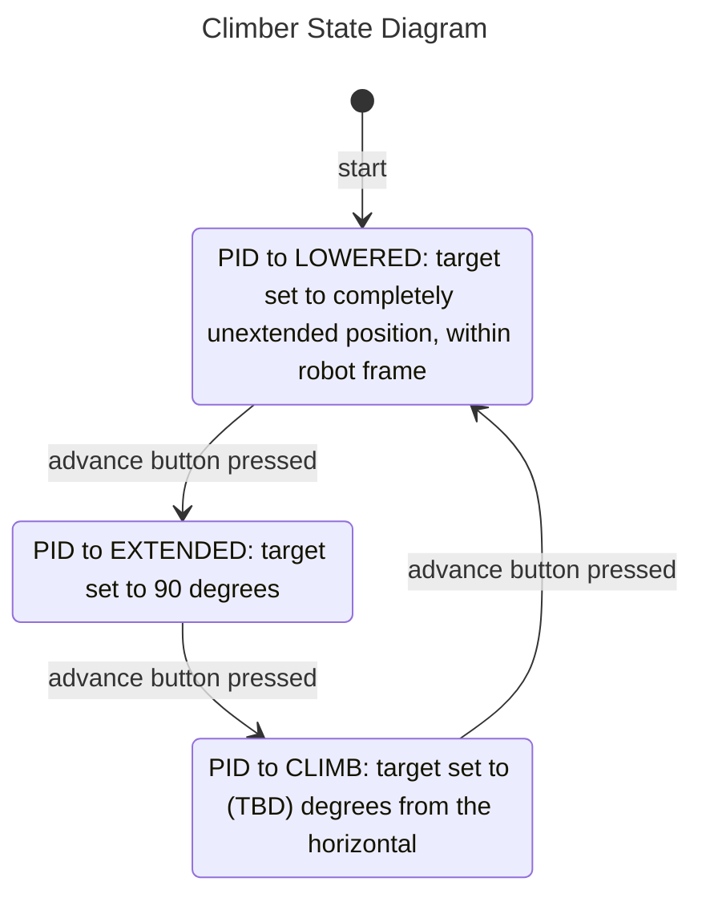

# Climber FSM Spec

```mermaid
---
title: Climber State Diagram
---
stateDiagram-v2
state "PID to LOWERED: target set to completely unextended position, within robot frame" as LOWERED
state "PID to EXTENDED: target set to 90 degrees" as EXTENDED
state "PID to CLIMB: target set to (TBD) degrees from the horizontal" as CLIMB
[*] --> LOWERED: start


LOWERED --> EXTENDED: advance button pressed
EXTENDED --> CLIMB: advance button pressed
CLIMB --> LOWERED: advance button pressed
```

