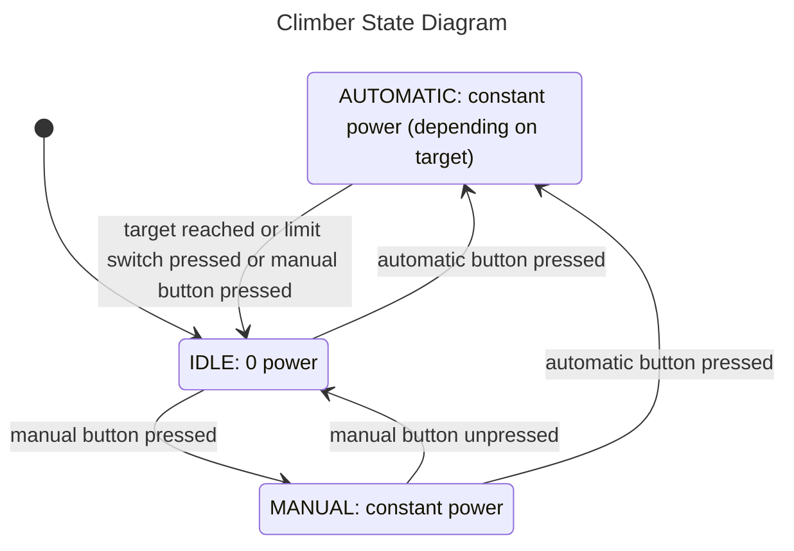

# Climber FSM Spec

```mermaid
---
title: Climber State Diagram
---
stateDiagram-v2
state "AUTOMATIC: constant power (depending on target)" as A
state "MANUAL: constant power" as M
state "IDLE: 0 power" as I
[*] --> I
I --> M: manual button pressed
M --> I: manual button unpressed
I --> A: automatic button pressed
A --> I: target reached or limit switch pressed or manual button pressed
M --> A: automatic button pressed
```