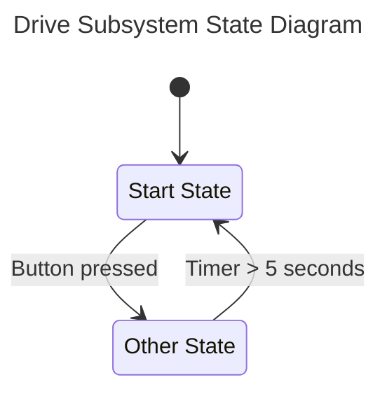

# Drive FSM Spec

```mermaid
---
title: Drive Subsystem State Diagram
---
stateDiagram-v2
  state "Start State" as START_STATE
  state "Other State" as OTHER_STATE

  [*] --> START_STATE
  START_STATE --> OTHER_STATE: Button pressed
  OTHER_STATE --> START_STATE: Timer > 5 seconds
```