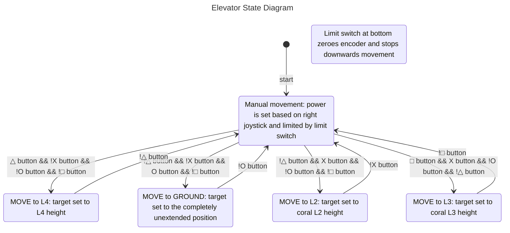

# Elevator FSM Spec

```mermaid
---
title: Elevator State Diagram
---
stateDiagram-v2
state "Manual movement: power is set based on right joystick and limited by limit switch" as MANUAL
state "MOVE to L4: target set to L4 height" as L4
state "MOVE to GROUND: target set to the completely unextended position" as GROUND
state "MOVE to L2: target set to coral L2 height" as L2
state "MOVE to L3: target set to coral L3 height" as L3

[*] --> MANUAL: start

MANUAL --> L4: △ button && !X button && !O button && !□ button
MANUAL --> GROUND: !△ button && !X button && O button && !□ button
MANUAL --> L2: !△ button && X button && !O button && !□ button
MANUAL --> L3: □ button && X button && !O button && !△ button
L4 --> MANUAL: !△ button
L2 --> MANUAL: !X button
L3 --> MANUAL: !□ button
GROUND --> MANUAL:  !O button

note: Limit switch at bottom zeroes encoder and stops downwards movement

```