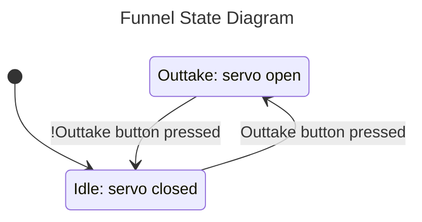

# Funnel FSM Spec

```mermaid
---
title: Funnel State Diagram
---
stateDiagram-v2
  state "Outtake: servo open" as OUTTAKE
  state "Idle: servo closed" as IDLE

  [*] --> IDLE
  IDLE --> OUTTAKE: Outtake button pressed
  OUTTAKE --> IDLE: !Outtake button pressed
```